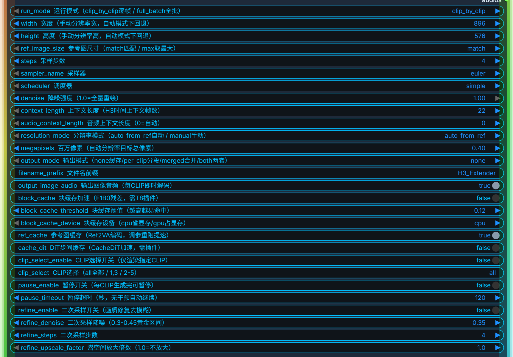

# BSAI ComfyUI H3 Film Factory

BSAI 出品的 MiniMax H3 电影工厂节点，支持多 clip 分镜逐帧生成、单 clip 重渲染、参考图资产库、二次采样画质修复、per-clip 实时预览解码。

## 节点参数说明（中英对照）



### 基础参数

| 参数名 | 中文说明 | 取值范围 / 选项 | 默认值 | 使用说明 |
|---|---|---|---|---|
| `run_mode` | 运行模式 | `clip_by_clip` / `full_batch` | `clip_by_clip` | `clip_by_clip` 逐 clip 生成，每 clip 完成后可预览；`full_batch` 全批一次性生成 |
| `width` | 宽度（手动分辨率宽） | 32 的倍数，最大 4096 | `896` | 手动模式下的渲染宽度；自动模式下会被回退覆盖 |
| `height` | 高度（手动分辨率高） | 32 的倍数，最大 4096 | `576` | 手动模式下的渲染高度；H3 原生最佳分辨率 896×576 |
| `ref_image_size` | 参考图尺寸 | `match` / `max` | `max` | `match` 匹配参考图尺寸；`max` 取最大参考图尺寸 |
| `steps` | 采样步数 | 正整数 | `4` | FastH3 蒸馏模型推荐 4 步；原生模型推荐 20-24 步 |
| `sampler_name` | 采样器 | `euler` / `euler_ancestral` 等 | `euler` | FastH3 蒸馏模型必须用 `euler` |
| `scheduler` | 调度器 | `simple` / `normal` 等 | `simple` | FastH3 蒸馏模型必须用 `simple` |
| `denoise` | 降噪强度 | 0.0 - 1.0 | `1.0` | 1.0 = 全量重绘；图生视频时可降低以保留参考图结构 |

### 上下文参数

| 参数名 | 中文说明 | 取值范围 / 选项 | 默认值 | 使用说明 |
|---|---|---|---|---|
| `context_length` | 上下文长度（H3时间上下文帧数） | 正整数 | `22` | 每个 clip 的 latent 上下文帧数，影响单 clip 生成时长 |
| `audio_context_length` | 音频上下文长度 | 0 = 自动，正整数 | `0` | 音频 latent 上下文长度，0 为自动匹配 |

### 分辨率参数

| 参数名 | 中文说明 | 取值范围 / 选项 | 默认值 | 使用说明 |
|---|---|---|---|---|
| `resolution_mode` | 分辨率模式 | `auto_from_ref` / `manual` | `auto_from_ref` | `auto_from_ref` 根据参考图和 megapixels 自动计算；`manual` 使用手动 width/height |
| `megapixels` | 百万像素（自动分辨率目标总像素） | 0.01 - 16.0 | `0.40` | 自动模式下的目标总像素数；如 0.40 ≈ 896×448；手动模式下不生效 |

### 输出参数

| 参数名 | 中文说明 | 取值范围 / 选项 | 默认值 | 使用说明 |
|---|---|---|---|---|
| `output_mode` | 输出模式 | `none` / `per_clip` / `merged` / `both` | `none` | `none` 仅缓存；`per_clip` 每 clip 分段输出；`merged` 合并输出；`both` 两者都输出 |
| `filename_prefix` | 文件名前缀 | 字符串 | `H3_Extender` | 输出文件的文件名前缀 |
| `output_image_audio` | 输出图像音频（每CLIP即时解码） | `true` / `false` | `true` | 每 clip 生成完后即时解码为图像+音频预览；关闭可加速但无预览 |

### 缓存加速参数

| 参数名 | 中文说明 | 取值范围 / 选项 | 默认值 | 使用说明 |
|---|---|---|---|---|
| `block_cache` | 块缓存加速（F1B0残差，需T8插件） | `true` / `false` | `false` | 启用 F1B0 残差块缓存加速；需安装 T8 插件；追求最佳画质建议关闭 |
| `block_cache_threshold` | 块缓存阈值（越高越易命中） | 0.0 - 1.0 | `0.12` | 块缓存命中阈值，越高越容易复用缓存块；可能影响画质 |
| `block_cache_device` | 块缓存设备 | `cpu` / `gpu` | `cpu` | 块缓存存储设备；`cpu` 省显存，`gpu` 占显存但更快 |
| `ref_cache` | 参考图缓存（Ref2VA编码，调参重跑提速） | `true` / `false` | `true` | 缓存参考图的 Ref2VA 编码结果，调参重跑时跳过重复编码；不影响画质 |
| `cache_dit` | DiT步间缓存（CacheDiT加速，需插件） | `true` / `false` | `false` | 启用 CacheDiT 步间缓存加速；需安装 CacheDiT 插件；追求最佳画质建议关闭 |

### CLIP 选择与暂停参数

| 参数名 | 中文说明 | 取值范围 / 选项 | 默认值 | 使用说明 |
|---|---|---|---|---|
| `clip_select_enable` | CLIP选择开关（仅渲染指定CLIP） | `true` / `false` | `false` | 启用后仅渲染 `clip_select` 指定的 clip，其余跳过 |
| `clip_select` | CLIP选择 | `all` / `1,3` / `2-5` | `all` | 指定要渲染的 clip 编号；`all` 全部；支持逗号分隔和范围 |
| `pause_enable` | 暂停开关（每CLIP生成完可暂停） | `true` / `false` | `false` | 每 clip 生成完后暂停，等待用户操作（继续/合并/重渲染） |
| `pause_timeout` | 暂停超时（秒，无干预自动继续） | 正整数（秒） | `120` | 暂停后无用户操作的超时时间，超时自动继续生成下一 clip |

### 二次采样参数（画质修复去模糊）

| 参数名 | 中文说明 | 取值范围 / 选项 | 默认值 | 使用说明 |
|---|---|---|---|---|
| `refine_enable` | 二次采样开关（画质修复去模糊） | `true` / `false` | `false` | 启用二次采样修复，在主采样后对 latent 进行放大+去噪，提升画质 |
| `refine_denoise` | 二次采样降噪（0.3-0.45黄金区间） | 0.0 - 1.0 | `0.35` | 二次采样的去噪强度；0.3-0.45 为推荐区间；过低修不动模糊，过高会改变内容 |
| `refine_steps` | 二次采样步数 | 正整数 | `4` | 二次采样的去噪步数；放大倍数大时建议 8-12 步 |
| `refine_upscale_factor` | 潜空间放大倍数（1.0=不放大） | 1.0 - 4.0 | `1.0` | 二次采样前对 latent 空间维度的放大倍数；1.0 = 不放大仅去噪；2.0 = 分辨率翻倍 |

## 最佳画质配置建议

### FastH3 蒸馏模型（4步）不开二采
```
steps=4, sampler=euler, scheduler=simple, denoise=1.0
width=896, height=576, resolution_mode=manual
block_cache=false, cache_dit=false, ref_cache=true
refine_enable=false
```

### FastH3 蒸馏模型（4步）开二采
```
steps=4, sampler=euler, scheduler=simple, denoise=1.0
width=896, height=576, resolution_mode=manual
block_cache=false, cache_dit=false, ref_cache=true
refine_enable=true, refine_denoise=0.45, refine_steps=8, refine_upscale_factor=1.5
```

### 原生 H3 模型（20-24步）
```
steps=20-24, sampler=euler, scheduler=simple
width=896, height=576, resolution_mode=manual
block_cache=false, cache_dit=false
```

## 注意事项

- **FastH3 蒸馏模型必须使用 `euler` 采样器 + `simple` 调度器 + 4 步**，其他配置会导致画质严重下降
- **H3 原生最佳分辨率为 896×576**，超出此范围可能导致画质下降或出现伪影
- **追求最佳画质时关闭 `block_cache` 和 `cache_dit`**，缓存复用可能导致细节丢失
- **单 clip 重渲染模式下**，选中 clip 渲染完后会暂停，等待用户手动选择合并、继续生成或重渲染其他 clip
- **前置 latent 链缺失时**，系统会自动从第一个 clip 补渲染建立完整链，确保 clip 索引正确
