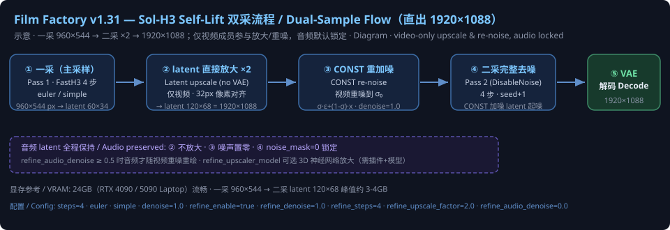

# BSAI ComfyUI H3 Film Factory ｜ BSAI ComfyUI H3 Film Factory

**MiniMax H3 电影工厂** — 多 Clip 分镜逐帧生成 + 单 Clip 重渲染 + 参考图资产库 + 二次采样画质修复 + per-Clip 实时预览解码
**A complete film production toolkit for MiniMax H3** — multi-Clip storyboard generation, single-Clip re-render, asset library, dual-sample quality refinement, per-Clip live preview

> 中文说明见下方；English documentation follows each section.

---

## 🚀 最新更新 / Latest Updates

### v2.65 (2026-09-25) — 独立渲染绝不自动补渲染其他 CLIP / Single Clip Render Never Auto-Builds Prefix

**核心：点卡片「▶ 独立渲染」只渲染这一个 CLIP——前置 latent 链不足时不再自动从前面补渲染一大段。**
**Core: the per-clip ▶ button renders exactly one CLIP — missing prefix latents no longer trigger an automatic re-render of a long earlier segment.**

---

- **修复**：点 CLIP29 ▶ 时若磁盘链仅 2 段，旧 v1.17/v1.21 补链逻辑会从 CLIP3 一路补渲染到 CLIP29（用户实测点 clip29 却渲染了 clip3）。现在 per-clip 独立渲染前置链不足时只警告、不补渲染，直接接续现有链末尾渲染指定 CLIP；同时前端 ▶ 按钮会清除其他 CLIP 残留的 replace_mode，避免之前点过的 ↻ 被一起重渲染。clip_select 批量选择的补链逻辑保持不变。
- Fix: clicking CLIP29 ▶ with only 2 segments on disk used to auto re-render CLIP3–29 (the v1.17/v1.21 prefix build). Now a short prefix chain only logs a warning and the chosen CLIP renders right after the existing chain tail; the ▶ button also clears stale replace_mode on other clips. The clip_select batch path keeps its prefix-build behavior.

---

### v2.64 (2026-09-25) — 独立渲染优先 / Per-Clip Independent Render Priority

**核心：点卡片「▶ 独立渲染」只渲染指定 CLIP——即使节点上残留了「CLIP选择开关」的选择集，也不被选择集覆盖。**
**Core: the per-clip ▶ button now always renders exactly the chosen CLIP — a leftover "Clip Select" range can no longer override it.**

---

- **修复**：此前点「▶ 独立渲染」时若节点上残留 clip_select（如参数区「CLIP选择开关」开着、填 11-30），渲染循环的 `i not in select_override` 会跳过用户指定的 CLIP，同时 v2.63 强制启用选择集内全部 CLIP → 点 clip9 ▶ 实际渲染的是 11-30。现在后端检测到 per-clip 独立渲染（replace_mode）时优先忽略 clip_select 范围选择（参数区开关/值保持用户原样不动），▶ 按钮永远只渲染指定 CLIP（前置 latent 链缺失时仍自动补渲染前置段建立链，不渲染后续未选中段）；不点 ▶ 直接运行仍按参数区 clip_select 渲染。
- Fix: with a leftover clip_select range (e.g. the "Clip Select" switch on, 11-30), the loop's `i not in select_override` skipped the chosen clip and v2.63 force-enabled the whole range — clicking clip9 ▶ rendered 11-30 instead. The backend now gives per-clip replace_mode priority and ignores clip_select while the parameter-panel switch/value stay untouched. ▶ always renders exactly the chosen CLIP (missing prefix latents are auto-built, no trailing clips rendered); running without ▶ still follows the panel clip_select.

---

### v2.63 (2026-09-23) — clip_select 权威选择修复 / Clip Select Authority Fix

**核心：勾选「CLIP选择开关」后，clip_select 指定的选中集（含自动补渲染的前置/中段缺口）一律真正渲染，不再被残留的 render_enabled=✗ 静默跳过。**
**Core: with "Clip Select" enabled, the selected set (including auto-filled prefix/middle-gap clips) is always actually rendered — no longer silently skipped by stale per-clip ✗ toggles.**

---

- **修复**：`clip_select=11-30` 时若卡片上残留「独立渲染▶ / ↻」留下的 `render_enabled=✗`，选中段被循环的 `not render_enabled` 条件静默跳过：前置链补不出来、选中段不渲染，首个被渲染的 clip 错放到链索引 0，导致预览解码越界、轨道无输出。现在 clip_select 显式选择时，选择集内一律强制 `render_enabled=True`（与 v1.21 强制渲染前置 clip 同一原则），并在日志打印被强制启用的 CLIP 列表。
- Fix: with `clip_select=11-30`, stale `render_enabled=✗` flags (left by a previous ▶ single-render / ↻ replace action) made the loop's `not render_enabled` check silently skip selected clips — the prefix chain was never built, selected clips never rendered, and the first rendered clip landed at chain index 0 (preview decode out of range, no track output). Now an explicit clip_select forces `render_enabled=True` for the whole selected set before the loop (same principle as v1.21's forced prefix render), with the forced CLIP list printed to the log.

---

### v1.98 (2026-09-23) — 缓存永不自动删 + 渲染自动快照 + 一键恢复不补链 / Cache Protection + Auto-Snapshot + One-Click Restore Without Re-Rendering

**核心：只要渲染过，缓存就受保护、自动备份、可一键恢复，恢复后绝不从 CLIP1 重新渲染补链！**
**Once rendered, your cache is protected, auto-backed-up and one-click restorable — restored clips are never re-rendered from CLIP1!**

---

#### 🛡️ 一、缓存保护：渲染过永不自动删 / Cache Protection

- **任何截断（卡片减少、分辨率变化、工程导入等）前都无条件自动备份主链**，先备份再截断；缓存只可能被用户主动操作删除
  Before ANY chain truncation (card removal, resolution change, project import, etc.) the main chain is unconditionally backed up first; cache can only be removed by explicit user action
- 系统自动流程不再静默丢弃任何已渲染成果
  No automatic system path silently discards rendered work anymore

#### 📸 二、渲染完成自动快照 / Auto-Snapshot After Render

- 每次**渲染完成 / 合并输出**后自动快照整条链（数据 + 清单），保留最近 **5 份**，滚动清理
  After every **render completion / merge output**, the full chain (data + manifest) is auto-snapshotted; latest **5** kept with rolling cleanup
- 快照文件：`chain_extender_<id>.<时间戳>.snapshot.h3cache/.json`
  Snapshot files: `chain_extender_<id>.<timestamp>.snapshot.h3cache/.json`

#### ♻️ 三、一键恢复缓存（两个入口）/ One-Click Restore (Two Entries)

**入口 1 — 节点「恢复缓存」开关（参数列表末尾，执行后自动复位）**
**Entry 1 — Node "Restore Cache" toggle (at the END of the parameter list, auto-resets after execution)**
- 打开 → 运行 → 从最近自动快照恢复主链 → 恢复的 CLIP 标记为已渲染 → **只渲染新增 CLIP，不补链**
  Enable → Run → main chain restored from latest snapshot → restored clips marked as already-rendered → **only new clips render, no chain-fill**
- 执行完成前端自动把开关复位为关
  The toggle auto-resets to off after execution

**入口 2 — 前端工具栏「♻️ 恢复缓存」按钮**
**Entry 2 — Frontend toolbar "♻️ Restore Cache" button**
- 搜索源最高优先级 = 主链目录本身（自动快照/截断备份所在），可直接恢复自动快照
  Highest-priority search source = the main chain directory itself (where auto-snapshots / truncate backups live)

#### 🚫 四、恢复后不补链 / No Re-Rendering After Restore

- 恢复后主链 = 完整备份链 → 前置 latent 链检查直接通过 → **不会触发"从 clip1 自动补渲染"**
  After restore the main chain is complete → prefix latent-chain check passes directly → **no "auto-fill from clip1"**
- 恢复的 CLIP 全部标记 `validated=True` → 主循环跳过（秒级），只渲染真正新增的片段
  Restored clips are all marked `validated=True` → skipped by the main loop (seconds), only genuinely new clips render

#### 🐛 五、关键修复 / Key Fixes

- **WinError 32（文件占用）修复**：恢复源优先匹配 `*.snapshot.*` / `*.preclear.*` 明确备份，排除活跃主链（正被 mmap 占用），占用/损坏候选自动跳过
  WinError 32 (file-in-use) fixed: restore sources prefer explicit `*.snapshot.*` / `*.preclear.*` backups, exclude the live main chain (mmap-held), and skip busy/corrupt candidates
- **恢复分辨率校验**：备份链分辨率 ≠ 当前渲染设置时**回滚恢复并给出明确指引**，不再"恢复成功 → 又被分辨率清链 → 从 CLIP1 补渲染"（latent 链不能跨分辨率复用）
  Restore resolution guard: if backup chain resolution ≠ current render settings the restore is **rolled back with clear guidance**, no more "restore OK → cleared by resolution change → re-render from CLIP1" (latent chains cannot be reused across resolutions)
- **参数兼容**：`restore_cache` 追加在参数列表**末尾**，原有参数顺序完全不变，旧工作流不报错
  Workflow compatibility: `restore_cache` appended at the END of the parameter list; existing parameter order unchanged, old workflows unaffected

---

### v2.62 (2026-09-22) — CLIP 选择渲染增强 + 链完整性修复 / Clip Select Enhancements + Chain Integrity Fixes

**核心：CLIP 选择（clip_select）现在支持任意多选、范围与组合，未选中的 CLIP 保留缓存不重新生成！**
**Now `clip_select` supports arbitrary multi-select, ranges and combinations — unselected clips keep their cache and are not re-rendered!**

---

#### 🎯 一、CLIP 选择渲染 / Clip Select Rendering

**在节点上勾选「CLIP选择开关」后，在「CLIP选择」框输入：**
**Enable the "Clip Select" toggle on the node, then type in the "Clip Select" box:**

| 输入 / Input | 效果 / Effect |
|---|---|
| `all` | 渲染全部 CLIP / Render all clips |
| `1,3` | 仅渲染 CLIP 1 和 3 / Render only clips 1 and 3 |
| `2-5` | 渲染 CLIP 2 到 5 / Render clips 2 through 5 |
| `7-10` | 渲染 CLIP 7 到 10 / Render clips 7 through 10 |
| `3,5,7` | 仅渲染 CLIP 3、5、7 / Render only clips 3, 5, 7 |
| `3，5，7` | 兼容中文标点（全角逗号/顿号/分号、全角连字符）|
| | Chinese full-width punctuation supported (`，`、`、`、`；`, `－`) |
| `2`（单选）/ single | 从 CLIP 2 连续渲染到末尾（续渲染语义）/ From clip 2 continuously to the end (resume semantics) |

- **未选中的 CLIP 保留磁盘缓存、不重新生成**（适合改完个别分镜后局部重渲染）
  Unselected clips keep their disk cache and are **not re-rendered** (ideal for re-rendering only edited shots)
- **输入无法解析时输出 WARNING 提示**，不再静默渲染全部
  Invalid input prints a WARNING instead of silently rendering everything

#### 🔗 二、链完整性自动补齐 / Automatic Chain-Integrity Fill

**H3 链式运动上下文要求 latent 连续。选择跨度内被跳过且磁盘无缓存的 CLIP 会自动补渲染，并明确打印日志。**
**H3 chain motion-context requires contiguous latents. Skipped clips inside the selected span that have no disk cache are auto-filled with a clear log message.**

- 前置缺失段自动补渲染建立完整链 / Missing prefix segments auto-rendered to build the chain
- 中段缺口（如缓存有 1-2、选 3,5,7 时 CLIP4/6）自动补渲染 / Middle gaps (e.g. clips 4/6 when cache has 1-2 and you select 3,5,7) auto-filled
- 补渲染范围收窄到**选中段跨度内**，末尾未选中的 CLIP 保留缓存，不再一路补到片尾
  Fill scope narrowed to the selected span; unselected trailing clips keep cache and are not filled to the end

#### ♻️ 三、恢复缓存改进 / Restore Cache Improvements

- **多源 fallback 搜索链快照**：自动在插件目录、ComfyUI 根目录、主项目根、用户主目录逐级查找链快照，修复 v2.61 硬编码 backup 目录导致备份找不到的问题
  Multi-source fallback search for chain snapshots (plugin root → ComfyUI root → project root → user home), fixing v2.61's hardcoded backup dir
- **损坏链重建保护**：manifest 声称有段但磁盘只有 magic header（空文件）时，自动识别并触发重建，修复 `clip_select` 部分渲染时 `invalid chain index 0/0` 报错
  Corrupted-chain rebuild protection: detects manifest/disk mismatch (empty magic-header file) and triggers a clean rebuild, fixing `invalid chain index 0/0` on partial renders

#### 🖥️ 四、Windows 稳定性修复 / Windows Stability Fix

- 新增 `prestartup.py`：修复 Windows + Python 3.13 + aiohttp 下静态文件请求死锁（浏览器能开页面但 JS/CSS 永远加载不出来）。默认线程池升级到 256 worker + 静态路径同步解析
  New `prestartup.py` fixes the Windows aiohttp static-file deadlock (page loads but JS/CSS hang at "0 bytes received"): default executor upgraded to 256 workers + synchronous static path resolution

#### 📦 五、其他 / Other

- **新增示例工作流**：`example_workflows/百声电影工厂（H3全自动电影短片生成）v1.json`
  New example workflow: fully automatic film short generator
- **修复演示工作流** `BSAI_H3_ClipSelect_Pause.json`：控件顺序错位导致 `clip_select` 收到错误值（120.0）的问题已对齐
  Fixed demo workflow widget-order drift that made `clip_select` receive a wrong value (120.0)

---

### v2.61 (2026-09-22) — ♻️ 恢复缓存 体验修复 / Restore Cache UX Fixes

**恢复缓存按钮体验全面优化，关机续渲染更顺畅！**
**Restore Cache button UX polished — resume after reboot is now seamless!**

---

#### 1. 刷新弹窗修复 / Refresh-Prompt Fix

**「♻️ 恢复缓存」恢复成功后，默认改为"留在当前页面"，把已恢复 N 个 CLIP 的数量写到节点状态栏（紫色文字）。**
**After "♻️ Restore Cache" succeeds, the default is now "stay on current page" — the restored clip count is shown in the node status bar (purple text).**

- 不再强制刷新页面，避免 ComfyUI 的 `beforeunload` 拦截弹"是否离开网站"让用户误以为缓存丢失
  No more forced page reload, avoiding the misleading "leave site?" prompt caused by ComfyUI's own `beforeunload` listener
- 需要时手动 Ctrl+R 刷新即可 / Manually refresh (Ctrl+R) when needed

#### 2. 渲染循环自动读盘 / Auto-Read Fresh Chain Cache

**留在当前页面后，再次 Queue Prompt 时自动读取刚被恢复的 `.h3cache`，跳过已渲染完成的 CLIP，直接从断点继续。**
**When you queue another prompt, the renderer auto-loads the freshly restored `.h3cache` and continues from the break-point, skipping already-rendered clips.**

#### 3. 新增 mp4 预览路由 / New Clip Preview Routes

**后端新增 `/h3_extender/clip_preview` 与 `/h3_extender/clip_preview/file` 两个路由，修复"恢复缓存后右侧预览面板仍空白"问题。**
**Two new backend routes serve the newest per-clip mp4 from `output/bsai_clips/`, fixing the empty preview panel after cache restore.**

---

### v2.60b (2026-09-21) — 收起CLIP + 恢复缓存 + 关机续渲染 / Collapse CLIP + Restore Cache + Resume After Reboot

**两大实用功能：一键收起CLIP节省空间，一键恢复缓存关机续渲染！**
**Two handy features: collapse CLIPs to save space, restore cache to resume after reboot!**

---

#### 📦 一、收起CLIP按钮 / Collapse CLIP Button

**工具栏新增"📦 收起CLIP"按钮，点一下收起到只显示5个CLIP高度，其他CLIP用滚动条查看。**
**New "📦 Collapse CLIP" button in toolbar: click to collapse to show only 5 clips height, scroll for the rest.**

- **按钮位置 / Button Location**: 暂停按钮后面（绿色按钮）/ After pause button (green button)
- **收起后 / After Collapse**: 只显示5个CLIP高度，其他CLIP用滚动条上下滑动
  Only show 5 clips height, scroll up/down for other clips
- **再点一下 / Click Again**: 恢复全部展开
  Restore to fully expanded

---

#### ♻️ 二、恢复缓存按钮 / Restore Cache Button

**工具栏新增"♻️ 恢复缓存"按钮，点一下恢复最近一次渲染的所有缓存、CLIP成品、预览文件，不用从CLIP1重新渲染！**
**New "♻️ Restore Cache" button in toolbar: click to restore all cache, clips, and previews from last render — no need to restart from CLIP1!**

**恢复内容 / What Gets Restored**:
1. **链缓存（h3cache）**: 恢复到 `bsai_h3_chain_cache/` 目录
   Chain cache restored to `bsai_h3_chain_cache/`
2. **CLIP 成品（mp4）**: 恢复到 `output/bsai_clips/` 目录
   Final clips restored to `output/bsai_clips/`
3. **预览文件（_clippv_*.mp4）**: 恢复到 `temp/` 目录，每个CLIP预览窗口都能随时打开预览
   Preview files restored to `temp/`, every clip preview can be opened anytime

---

#### ⚡ 三、关机开机续渲染技巧 / How to Resume After Reboot

**渲染到一半要关机？不用怕，这样操作就能从上次结束的地方继续！**
**Need to reboot mid-render? No problem — follow these steps to resume where you left off!**

##### ✅ 正确操作步骤 / Correct Steps:

1. **等当前CLIP渲染完**（不要中途关机）
   Wait for current clip to finish rendering (don't reboot mid-clip)

2. **直接关机就行**（不用点暂停）
   Just shut down directly (no need to click pause)

3. **晚上开机后 / After Reboot**:
   - 打开工作流 / Open your workflow
   - 点一下 **"♻️ 恢复缓存"** 按钮 / Click the **"♻️ Restore Cache"** button
   - 直接点渲染 / Click render
   - 就会从上次结束的CLIP继续渲染 / It will resume from the last completed clip

##### ❌ 错误操作（不要这样做）/ Wrong Steps (Don't Do This):

- 点暂停 → 直接关机 → 开机后点继续
  Click pause → shut down directly → click resume after reboot
  - **为什么不行 / Why It Doesn't Work**: 暂停状态存在内存里，关机后就没了
  Pause state is in memory, it's gone after reboot

##### 📊 为什么这样行 / Why This Works:

| 状态 / State | 保存位置 / Saved In | 关机后还在吗 / Survives Reboot? |
|-------------|---------------------|-------------------------------|
| 暂停按钮状态 / Pause State | 内存 / Memory | ❌ 没了 / Gone |
| 链缓存（h3cache）/ Chain Cache | 硬盘 / Disk | ✅ 还在 / Survives |
| 已渲染的CLIP / Rendered Clips | 硬盘 / Disk | ✅ 还在 / Survives |
| 预览文件 / Preview Files | 硬盘备份 / Disk Backup | ✅ 恢复后还在 / Restored |

---

### v2.54 (2026-09-20) — 电影模板 + 性能优化 + Bug 修复 / Cinematic Templates + Performance + Bug Fixes

**全新电影提示词模板系统，一键统一全片运镜/调色/氛围，画布响应速度提升 10 倍！**
**Brand-new cinematic prompt template system, one-click unify camera/color/mood across all shots, 10x faster canvas interaction!**

---

#### 🎬 一、电影提示词模板系统 / Cinematic Prompt Templates

**38 个内置电影专业模板，覆盖运镜、调色、构图、氛围四大类，一键应用全片或单 CLIP。**
**38 built-in professional cinematic templates covering camera movement, color grading, composition, and mood — one-click apply to whole film or single clip.**

| 分类 / Category | 数量 / Count | 示例 / Examples |
|---------------|-------------|-----------------|
| 🎥 电影运镜 / Camera Movement | 12 | 缓推 Push In, 拉远 Pull Back, 跟拍 Tracking, 环绕 Orbit, 手持 Handheld, 斯坦尼康 Steadicam... |
| 🎨 电影调色 / Color Grading | 10 | 暖调 Warm, 冷调 Cool, 青橙 Teal & Orange, 黑白 Noir, 莫兰迪 Morandi, 霓虹赛博 Neon Cyber... |
| 🎬 画面分割 / Aspect & Composition | 6 | 宽屏 Widescreen, 上下黑边 Letterbox, 三分 Rule of Thirds, 框中框 Frame-in-Frame... |
| ✨ 电影感 / Cinematic Feel | 10 | 电影级画质 Cinematic Quality, 戏剧光影 Dramatic Light, 黄金时刻 Golden Hour, 雨夜 Rainy Night, 紧张悬疑 Tense Suspense, 史诗宏大 Epic... |

**两种应用模式 / Two Application Modes**:

1. **全局应用 / Global Apply**:
   - 节点顶部工具栏 `✨ 模板` 按钮，一键应用到**所有 CLIP + 全局提示词**
   - Top toolbar "✨ 模板" button, one-click apply to **ALL clips + global prompt**
   - 适合：全片统一调色、统一运镜风格、统一氛围
   - Best for: unifying color grading, camera style, or mood across the whole film

2. **单 CLIP 应用 / Per-Clip Apply**:
   - 每个 CLIP 左侧面板新增 `模板` tab，独立应用到当前 CLIP
   - Left panel "模板" tab on each clip, apply to current clip only
   - 其他 CLIP 完全不受影响
   - Other clips are completely unaffected

**合并选项 / Merge Options**:
- 【确定】= **合并 / Merge**: 保留全局模板，再加单 CLIP 模板
- 【取消】= **覆盖 / Overwrite**: 移除全局模板，只保留单 CLIP 模板

**模板标记 / Template Tags**:
- 全局模板：`[电影风格-全局]...[/电影风格-全局]`
- 单 CLIP 模板：`[电影风格-单CLIP]...[/电影风格-单CLIP]`
- 插入位置：每个 CLIP 提示词**最顶部**，清晰可随时删除

---

#### ⚡ 二、性能优化 / Performance Optimizations

**画布拖动卡、资产面板加载慢的问题彻底解决！**
**Fixed slow canvas dragging and slow asset panel loading!**

1. **资产面板缓存 / Asset Panel Cache**:
   - refs 没变不重新渲染，避免 150+ 个 img 重复加载
   - Skip re-render when refs unchanged, no more 150+ duplicate image loads
   - 加载速度提升 **10 倍以上**
   - Loading speed improved by **10x+**

2. **全局定时器降频 / Global Poll Rate Reduced**:
   - 从 500ms 降到 2000ms，减少 75% 的轮询开销
   - From 500ms to 2000ms, reducing polling overhead by 75%
   - 去掉重复的节点级定时器
   - Removed duplicate node-level timers

3. **CLIP 卡片智能显示 / Smart CLIP Card Display**:
   - 外部提示词输入几个分镜，自动显示几个 CLIP
   - Auto show N clips when N shots are entered in external prompt
   - 未输入时默认只显示 CLIP1，节省屏幕空间
   - Default to CLIP1 only when no prompt entered, saves screen space
   - 节点背景自动跟随 CLIP 数量伸缩
   - Node background auto-resizes with CLIP count

---

#### 🧠 三、时间分块 + 语义桥 / Temporal Chunking + Semantic Bridge

**两大核心技术升级：长片段防 OOM + 提示词更听话！**
**Two major technical upgrades: long clip OOM protection + better prompt adherence!**

##### ⏱️ 时间分块（v2.02）/ Temporal Chunking

**长片段二采防 OOM：沿时间轴（T 轴）切分二采 latent，逐段采样，峰值显存大幅降低。**
**Long clip OOM protection: split refine latent along the temporal axis (T), sample segment by segment, drastically reduces peak VRAM.**

- **区别于空间分块**: 空间分块沿 H/W（宽高）切，时间分块沿 T（时间）切
- **Different from spatial tiling**: spatial tiles along H/W (width/height), temporal chunks along T (time)
- **重叠区平滑接管**: 相邻段重叠区冻结 + smoothstep 接管，避免接缝
- **Smooth overlap**: frozen overlap region + smoothstep blending, no visible seams
- **参数说明 / Parameters**:
  - `temporal_chunk_tokens`: 时间分块长度（沿 T 轴切的 token 数）
  - `temporal_overlap_tokens`: 相邻段重叠 token 数（越大越稳越慢，一般 8~12）
- **使用建议 / Usage Tips**:
  - 0 = 关闭（默认整段二采）
  - T~107（约 4 秒）时建议 40~60
  - 长片段（15 秒+）二采必开，否则容易 OOM

##### 🌉 语义桥（v2.19）/ Semantic Bridge

**让 H3 更听话：用一个约 11MB 的小 MLP 对文本编码器 token 做残差混合，显著提升构图/空间/计数等提示词遵循度。**
**Better prompt adherence: a ~11MB small MLP does residual mixing on text encoder tokens, significantly improves adherence to composition / spatial / counting prompts.**

- **原理 / How it works**:
  - 原版蒸馏于 FL2VA 模型，本插件做了 Ref2VA 强制兼容
  - Original model distilled for FL2VA; this plugin adds Ref2VA compatibility
  - 公式：`C = H + α * (S - H)`，其中 H 是原始 token，S 是桥接 token，α 是强度
  - Formula: `C = H + α * (S - H)`, where H is original token, S is bridge token, α is strength
- **参数说明 / Parameters**:
  - `semantic_bridge_enable`: 开关（默认关，不影响旧工作流）
  - `semantic_bridge_adapter`: 权重文件选择（放 `ComfyUI/models/semantic_bridge/`）
  - `semantic_bridge_alpha`: 桥接强度（默认 0.15，越大越听话，太大会崩）
  - `semantic_bridge_magnitude_match`: 模长对齐（原版默认开，保持即可）
- **推荐权重 / Recommended Weights**:
  - `speach1sdef178/MiniMax-H3-Semantic-Bridge` — 原版通用
  - `JOKER141/BUNNY_H3_Conditioning_Bridge` — 偏动作/多人场景

---

#### 🐛 四、重要 Bug 修复 / Critical Bug Fixes

1. **刷新页面后缓存误清空 / Cache Cleared on Refresh**:
   - 修复：分辨率未稳定时校验，误判不匹配清空缓存
   - Fixed: cache was incorrectly cleared when resolution not yet stabilized on page load
   - 现在刷新页面后，之前生成的 CLIP 缓存完整保留
   - Now all previously generated clip caches are preserved on refresh

2. **外部提示词清空不同步 / External Prompt Clear Sync**:
   - 修复：清空外部全局提示词后，内部全局提示词不同步清空
   - Fixed: internal global prompt not cleared when external global prompt is cleared
   - 现在清空外部提示词，内部全局 + 所有 CLIP 全部同步清空
   - Now clearing external prompt syncs internal global + all clips immediately

3. **tab 切换后资产面板打不开 / Asset Panel Broken After Tab Switch**:
   - 修复：模板 tab 打开后，资产 tab 打不开
   - Fixed: asset tab stopped working after opening template tab
   - 现在 tab 切换完全正常
   - Now tab switching works perfectly

4. **CLIP 提示词框太小看不全 / CLIP Prompt Box Too Small**:
   - 新增：CLIP 提示词框右下角可拖拽拉高度
   - Added: resize handle at bottom-right of each clip prompt box
   - 初始高度 200px，可任意拉高
   - Initial 200px height, resizable to any height

5. **另存工作流报错 / Save Workflow Error**:
   - 修复：另存工作流时报 `structuredClone` 错误（`__h3Extender` 不可枚举属性导致）
   - Fixed: `structuredClone` error when saving workflow (non-enumerable `__h3Extender` property)
   - 现在另存工作流完全正常
   - Now saving workflows works perfectly

6. **二采开头 39 帧重影模糊 / Refine First 39 Frames Ghosting**:
   - 修复：二采 refine 时 motion-context keyframe 未清空，导致开头重影错位模糊
   - Fixed: motion-context keyframe not cleared in refine pass, causing ghosting/blurry first 39 frames
   - 现在二采开头画面干净清晰
   - Now refine start frames are clean and sharp

7. **导入空包误删旧链备份 / Empty Import Deletes Old Chain**:
   - 修复：导入空包时静默删除旧链备份，v1.97 防误清机制没覆盖导入路径
   - Fixed: empty import silently deleted old chain backup, v1.97 protection missed the import path
   - 现在导入前自动备份，不会误删整链
   - Now auto-backup before import, no more accidental chain loss

---

#### 🎛️ 五、其他重要优化 / Other Important Improvements

1. **全局资产引用折叠显示 / Global Asset Refs Folded Display**:
   - 之前：全局引用太多时，所有引用的资产全部展示，占满界面
   - Before: when too many global refs, all referenced assets displayed, taking too much space
   - 现在：每个 CLIP 只显示自己引用的资产，同一资产引用次数用数字角标表示
   - Now: each CLIP only shows its own referenced assets, reference count shown as number badge
   - 界面更清爽，占用更少
   - Cleaner UI, less space usage

2. **CLIP 节点高度自动扩展 / Node Height Auto-Expand**:
   - 之前：CLIP 超过 12 个时，节点高度被截断，只剩 4 个卡片能看到
   - Before: when more than 12 clips, node height was truncated, only 4 cards visible
   - 现在：节点高度自动扩展到 8000px，再多 CLIP 也能完整显示
   - Now: node height auto-expands to 8000px, even more clips fully visible
   - 底部黑色背景自动跟随 CLIP 数量伸缩
   - Bottom black background auto-resizes with CLIP count

3. **重启后资产链接自动恢复 / Asset Refs Auto-Restore on Restart**:
   - 之前：重启 ComfyUI 或刷新工作流后，所有 CLIP 的资产 @引用 全部丢失
   - Before: after restarting ComfyUI or refreshing workflow, all CLIP asset @refs were lost
   - 现在：已引用资产面板同时解析 CLIP prompt + 全局 prompt，重启后自动恢复
   - Now: asset panel parses both CLIP prompt + global prompt, auto-restores after restart
   - 不需要重新输入全局提示词来重新链接资产库
   - No need to re-enter global prompt to re-link asset library

4. **剧本输入自动建 CLIP / Auto-Create CLIP from Script**:
   - 输入外部全局提示词（剧本）后，自动按 `[分镜N]` 数量创建对应数量的 CLIP 卡片
   - After entering external global prompt (script), auto-create CLIP cards based on `[Shot N]` count
   - 节点自动撑高到对应 CLIP 数量，不需要手动拉
   - Node auto-expands to match CLIP count, no manual resizing needed
   - 实时解析，输入完立即生效
   - Real-time parsing, takes effect immediately after input

---

### v1.86 (2026-09-15) — VDN-H3 极速档 + Bullet Time Lora 集成 / VDN-H3 Presets + Bullet Time LoRA
- **VDN-H3 速度档 / VDN-H3 speed presets**: speed_preset 新增 **极速-VDN / Turbo-VDN**、**均衡-VDN / Balanced-VDN**、**精细-VDN / Fine-VDN** 三档。VDN 模式一采固定 8 步（Video DeltaNet DMD 蒸馏最优，质量≈dense 50 步、长链线性注意力更稳），二采 3/4/6 步。需搭配 **VDN 版工作流**（workflows/电影工厂工作流-VDN版-均衡VDN8+4（tile_overlap128）.json）——BSAIVDNH3Loader（基座+linear_branch+LoRA 一体化）替换 Sol-H3 链路，自动跳过 FastH3 LoRA/Sol-Attn。／Three new presets for the ComfyUI-VDN-H3 pipeline: pass-1 fixed at 8 VDN steps (≈dense-50 quality), refine at 3/4/6 steps. Use the VDN workflow (BSAIVDNH3Loader replaces the Sol-H3 chain).
- **Bullet Time LoRA 集成 / Bullet Time LoRA**: 两个工作流（FastH3 版 & VDN 版）均在 Lora Stack 挂载 **BulletTime-MMH3.safetensors @ 0.5**，配合 BSAI-MiniMAX-H3-Prompt 的子弹时间模板触发词（ullet time + time-slow 强化句）使用。／Both workflows mount **BulletTime-MMH3.safetensors @ 0.5** in the LoRA stack, paired with the bullet-time trigger words in the prompt templates.

| 预设 / Preset | 一采步数 / Pass1 steps | 二采步数 / Refine steps | 二采分块 / Tiles | 二采降噪 / denoise | 单 Clip 耗时 / per-Clip |
|---|---|---|---|---|---|
| 极速 Turbo (FastH3) | 4 | 3 | 4 | 0.5 | ~20 min |
| 均衡 Balanced (FastH3) | 6 | 4 | 4 | 0.55 | ~28 min |
| 精细 Fine (FastH3) | 8 | 6 | 4 | 0.55 | ~40 min |
| 极速-VDN Turbo-VDN | 8 (VDN) | 3 | 4 | 0.5 | ~20 min |
| 均衡-VDN Balanced-VDN | 8 (VDN) | 4 | 4 | 0.55 | ~28 min |
| 精细-VDN Fine-VDN | 8 (VDN) | 6 | 4 | 0.55 | ~40 min |

---

### v2.61 (2026-09-22) — ♻️ 恢复缓存 体验修复 + mp4 预览重新挂载 / Restore Cache UX Fix + mp4 Preview Remount

**主要解决"♻️ 恢复缓存"按钮按完后右侧 mp4 预览窗空白的问题，并把"是否刷新页面"的选择权交回用户。**

**Solves: "♻️ Restore Cache" leaves the right-side mp4 preview panel blank, and gives the user a clean way to choose between reloading the page or staying on it.**

#### 🪩 一、为什么之前"恢复缓存"按完右侧预览是空的 / Why the preview panel was blank after restore

**修复前**：
- 后端 `/h3_extender/clip_preview`（在 `motion_context_disk.py`）只从 `bsai_h3_chain_cache/chain_extender_<owner>.json` 的 `segments[*].decoded_mp4_blob` 取 mp4
- 当 `manifest.segments` 为空数组（典型场景：缓存损坏 / 备份丢失），接口固定返回 `400 This clip has not been rendered yet.`
- 前端拿到 null 就显示"预览不可用"占位符
- 即使 `output/bsai_clips/h3_clip_<owner>_<idx>_<ts>.mp4` 真实存在、30 MB 完整，前端也无路可拿

**Before the fix:**
- Backend `/h3_extender/clip_preview` (in `motion_context_disk.py`) only reads mp4 blobs from `manifest.segments[*].decoded_mp4_blob`
- When `manifest.segments` is empty (typical after cache corruption / lost backup), the endpoint always returns `400 This clip has not been rendered yet.`
- The frontend gets `null` and shows the "preview unavailable" placeholder
- Even though `output/bsai_clips/h3_clip_<owner>_<idx>_<ts>.mp4` is fully present, the frontend had no way to fetch it

**修复后**：
- 新加后端路由 `/h3_extender/rendered_clips?owner_id=<owner>`：扫描 `output/bsai_clips/` 返回 `latest_filename_by_idx`（每个 clip_index 对应最新时间戳的 mp4 文件名）
- 前端 `fetchClipPreview` 拿不到原接口数据时自动 fallback → 调 `rendered_clips` 拿文件名 → 直接走 `ComfyUI /view?type=output&subfolder=bsai_clips&filename=...` stream 30MB mp4
- 索引错位 bug 修复：前端 `state.clips[]` 是 0-based，后端 `h3_clip_*_<idx>_` 是 1-based；fetchClipPreview 入口统一 `+1` 转换
- "♻️ 恢复缓存"按完后 `render(node, runtime)` 重画所有 DOM 卡片，每个已渲染 CLIP 立即显示对应 mp4 缩略图

**After the fix:**
- New backend route `/h3_extender/rendered_clips?owner_id=<owner>` scans `output/bsai_clips/` and returns `latest_filename_by_idx`
- Frontend `fetchClipPreview` automatically falls back to `rendered_clips` → uses `/view?type=output&subfolder=bsai_clips&filename=...` to stream the 30 MB mp4
- Index off-by-one fixed: `state.clips[]` is 0-based; `h3_clip_*_<idx>_` is 1-based; the entry-point of `fetchClipPreview` now does a single `+1` conversion
- After pressing "♻️ Restore Cache", `render(node, runtime)` rebuilds every card; every rendered CLIP immediately shows its mp4 thumbnail

#### 📝 二、♻️ 恢复缓存按钮 — 详细使用说明 / Detailed Usage

**按钮位置 / Button Location**: 节点顶部工具栏 / Top toolbar of the node

**第一步 / Step 1**: 点击 **「♻️ 恢复缓存」** / Click the button
- 弹出第一个确认框 / First confirm dialog:*
- "确定要恢复最近一次渲染的所有缓存吗？会恢复：链缓存（h3cache）+ 已渲染完成的 CLIP 成品。恢复后可以直接继续渲染后面的 CLIP，不用从 CLIP1 重新开始。"

**第二步 / Step 2**: 后端响应 / Backend response
- 后端走 `/h3_extender/restore_cache` 接口
- 在 `backup/chain_cache_2026-09-21/` 备份目录存在时复制 `.h3cache` / `_clippv_*.mp4` 到运行目录
- 统计 `output/bsai_clips/h3_clip_<owner>_*.mp4` 总数 → 返回 `clips_restored`（如本机示例的 40）

**第三步 / Step 3**: 第二个确认框（v2.61 新增）/ Second confirm dialog (new in v2.61)
- "恢复成功！已恢复 N 个 CLIP。点击「确定」刷新页面以挂载新的缓存；点击「取消」留在当前页面继续渲染（缓存文件已就绪，状态栏会显示已恢复数量）。"
- **点「确定」**：浏览器原生 `location.reload()`，状态栏会显示已恢复数，右侧预览按需自动 mount
- **点「取消」（推荐）**：留在当前页面，前端调 `/h3_extender/rendered_clips` 拿文件名 → 重画所有卡片 → 右侧预览 1-2 秒内亮起 mp4 缩略图

**常见问题 / FAQ**:
- **Q: 弹出了"是否离开网站"原生框怎么办？/ "Leave site?" native dialog?**
  A: 这是 ComfyUI/LiteGraph 注册的 `beforeunload` 拦截。v2.61 已先调 `graph.setDirty(false)` 再 reload，多数情况下不会弹；万一弹了，按"离开"完成刷新即可（缓存已经在磁盘上了）。
- **Q: 右侧仍然空白？**
  A: 打开 DevTools → Network，搜 `rendered_clips` / `view` 请求，把 URL 和响应截图给我。
- **Q: 取消按钮按了之后想刷新怎么办？**
  A: 直接 Ctrl+R 或 Ctrl+F5，缓存文件已就绪。
- **Q: 恢复缓存会把所有 mp4 都重渲染一遍吗？**
  A: 不会。恢复缓存只搬运磁盘文件；下一次 Queue Prompt 会自动读 `.h3cache` 跳过已渲染段。

#### 🔖 三、如何回滚到此版本 / How to roll back to this version

```bash
cd /path/to/BSAI-ComfyUI-H3-Film-Factory
git checkout v2.61               # 切到这个里程碑
# 或 git checkout 7d2a91f 等具体提交哈希
```

回滚后**重启 ComfyUI** 让新代码生效。备份目录 `output/bsai_clips/` 不在版本控制内，不要手动删除。

```bash
git checkout v2.61
# Then restart ComfyUI for the new code to load. output/bsai_clips/ is not in version control — do not delete it manually.
```

---

## 🚀 VDN-H3 + Bullet Time 快速上手 / Quick Start (v1.86)

### 1️⃣ VDN 极速档（一采质量≈dense 50 步）/ VDN speed presets
1. **安装 VDN 插件（已随包内嵌，零安装）** / Install: BSAI-ComfyUI-vdn-minimax-h3 ships with an embedded vdn_h3 runtime — no separate install.
2. **权重就位** / Weights: put the VDN stage under ComfyUI/models/vdn/stage-dmd-step-250/ (linear_branch + adapters/turbo + adapters/default). Base model: any ComfyUI-compatible MiniMax H3 in models/diffusion_models (recommended minimax_h3_fl2va_int8_convrot.safetensors).
3. **加载 VDN 版工作流** / Load workflows/电影工厂工作流-VDN版-均衡VDN8+4（tile_overlap128）.json — the chain is already wired:
   > **多合一版（推荐）** / **All-in-one (recommended)**: workflows/BSAI_H3_Film_Factory电影工厂128分钟大电影版-多合一版（FastH3+VDN双链路·tile_overlap128).json — 单工作流双链路切换（**开关 OFF=FastH3 一采** / **ON=VDN 8步+turbo 一采**），含分镜AI生成/资产库/BulletTime LoRA/Premiere 导出全套。Dual-chain switch (OFF=FastH3, ON=VDN) with AI storyboard, asset library, BulletTime LoRA & Premiere export.
   BSAIVDNH3Loader (backbone + stage + quality_mode=⚡速度优先) → Lora Stack → BSAIH3FilmFactory (speed_preset=均衡-VDN).
4. **切换档位** / Switch presets on the Film Factory node: 极速-VDN(8+3) / 均衡-VDN(8+4, default) / 精细-VDN(8+6).
5. **想更高画质** / For max quality: set BSAIVDNH3Loader.quality_mode = 🎨 画质优先 (16步+双LoRA) and Film Factory speed_preset = custom, steps = 16.
6. **Run** — pass-1 fixed at 8 VDN steps, then latent upscale ×2 and tiled refine.

### 2️⃣ Bullet Time LoRA（子弹时间）/ Bullet Time LoRA
1. **权重** / Weight: put BulletTime-MMH3.safetensors into ComfyUI/models/loras/ (standard ComfyUI H3 LoRA, ~96 MB).
2. **两个工作流均已挂载 @ 0.5** / Both FastH3 & VDN workflows already mount it in the Lora Stack (slot 2, strength 0.5).
3. **触发词已进模板** / Trigger words are baked into all 6 bullet-time prompt templates (BSAI-MiniMAX-H3-Prompt v1.10+): ullet time at the freeze-chapter start + *"time slows almost to completely, while the camera continues moving dynamically around the action."*
4. **强度建议** / Strength: 0.5 (clean with FastH3 turbo); try 0.7 for stronger effect, watch for deformation on fast action.
5. **手动叠加（自建工作流）** / Manual: insert a LoraLoaderModelOnly (BulletTime-MMH3, 0.5) between your model loader and the sampler.

### 2️⃣.5️⃣ 多合一版工作流 / All-in-one Workflow Guide

**文件 / File**: workflows/BSAI_H3_Film_Factory电影工厂128分钟大电影版-多合一版（FastH3+VDN双链路·tile_overlap128).json

一个工作流同时内置 **FastH3（Sol-H3）** 与 **VDN-H3** 两条模型链路，用开关一键切换，免去开两个工作流。同时含分镜 AI 生成（Qwen）、资产库、BulletTime LoRA、字幕、Premiere 导出全套。
One workflow bundles both **FastH3 (Sol-H3)** and **VDN-H3** model chains, switched by a single toggle — no need for two separate workflows. It also includes AI storyboard (Qwen), asset library, BulletTime LoRA, subtitles and Premiere export.

**双链路切换 / Chain Switch**：

| 开关 Switch | 链路 Chain | 250 档位同步选 Preset |
|---|---|---|
| **OFF**（默认 / default） | FastH3（Sol-H3 Loader 一采） | 极速 4+3 / 均衡 6+4 / 精细 8+6 |
| **ON** | VDN（BSAIVDNH3Loader ⚡8步+turbo 一采） | 极速-VDN 8+3 / 均衡-VDN 8+4 / 精细-VDN 8+6 |

**使用步骤 / Steps**：
1. 加载多合一工作流（/ Load the workflow）。
2. 拨开关选链路（OFF=FastH3，ON=VDN）；**每次只加载一条链路，避免显存双载 OOM**。/ Toggle the switch; only one chain loads at a time (prevents VRAM OOM from double-loading).
3. 在 250 BSAIH3FilmFactory 上选对应档位（见上表）。/ Pick the matching preset on the Film Factory node (see table).
4. 填分镜脚本/资产库，点 Run。/ Fill in the storyboard & assets, hit Run.

**注意事项 / Notes**：
- VDN 链路需 models/vdn/stage-dmd-step-250/ 权重 + models/diffusion_models 有基座；FastH3 链路只需 FastH3 基座。VDN requires the stage weights; FastH3 only needs the FastH3 base.
- BulletTime LoRA 已挂 276 槽 2 @0.5；tile_overlap=128 已设（去毛刺）；latent upscale ×2 内置（960×544 → 1920×1088）。/ BulletTime LoRA mounted at slot 2 @0.5; tile_overlap=128 (de-glitch); built-in latent upscale ×2.
- 想真 4K：FinalDecode 输出后外接放大节点。/ For true 4K, add an upscaler after FinalDecode.

### 3️⃣ 双机同步 / Multi-machine sync
- 本机与 4090 均 git pull 两个仓库: BSAI-ComfyUI-H3-Film-Factory (v1.86) + BSAI-MiniMAX-H3-Prompt (bullet-time trigger words).
- VDN stage + BulletTime LoRA 权重放各机 models/vdn/ 与 models/loras/（VDN 版工作流在无 VDN 权重的机器上会报缺文件，属预期）。

> 完整版本历史 / Full changelog → **CHANGELOG.md**

---

---

## 插件介绍 / Introduction

**H3 Film Factory** 是 BSAI 出品的 MiniMax H3 一站式电影制作节点集。它把"剧本分镜 → 逐镜头生成 → 画质修复 → 字幕 → 拼接成片"的完整影视流程整合进 ComfyUI：

**H3 Film Factory** is BSAI's all-in-one film production toolkit for MiniMax H3 in ComfyUI. It covers the whole movie pipeline: **storyboard → per-shot generation → quality refinement → subtitles → final assembly**.

### 核心能力 / Core capabilities
- **多 Clip 分镜逐帧生成**：`BSAIH3FilmFactory` 一个节点管理整部片子的分镜（CLIP 卡片），每张卡片独立提示词/字幕/音效/资产引用，逐 clip 生成、可预览可暂停。/ Multi-Clip storyboard: each CLIP card has its own prompt / subtitle / audio / asset refs, rendered clip-by-clip with preview & pause.
- **单 Clip 重渲染**：只重出某一个镜头（改提示词/换资产后重出该段），其余镜头不动。/ Re-render a single Clip only.
- **参考图资产库**：`BSAI_AssetLibraryInput` 上传图片/视频/音频，提示词用 `@图N` / `@视频N` / `@音频N` 引用。/ Asset library with `@图N` / `@视频N` / `@音频N` notation.
- **Sol-H3 Self-Lift 双采（v1.31）**：主采样后 latent 直接放大（不经过 VAE）+ CONST 重加噪 + 二采完整去噪，一采+二采直出 1920×1088 高清视频；音频默认锁定不重绘。/ Sol-H3 Self-Lift dual-sampling (v1.31): latent upscale (no VAE) + CONST re-noise + full second pass, direct 1920×1088 output; audio locked by default.
- **per-Clip 实时预览**：每生成完一个 clip 立即解码预览（图像+音频），可暂停/继续/仅保留当前/合并输出。/ Live preview after each clip with pause / continue / stop / merge controls.
- **字幕系统**：`BSAI_SubtitleConfig` + `BSAI_SubtitleRenderer` 支持旁白/对白字幕渲染。/ Subtitle config + renderer (narration / dialogue).
- **上下文帧提取/加载**：从长视频提取上下文帧建立运动连贯链（RAM/磁盘两种方案）。/ Contextual frame extraction & loading for motion continuity (RAM & disk backends).
- **3D Latent Upscaler**：`BSAI_H3_3DLatentUpscale` 神经网络语义放大 latent，比插值保留更多细节。/ Neural 3D latent upscaling.

---

## 节点清单 / Node List

全部位于 `BSAI/H3 Film Factory` 相关分类 / All under BSAI/H3 Film Factory categories:

| 节点 / Node | 作用 / Role |
|---|---|
| **BSAIH3FilmFactory**（核心主节点）| 多 Clip 分镜生成主节点：run_mode/分辨率/采样/上下文/缓存/二次采样/CLIP选择/暂停 全套控制。/ Main multi-Clip generation node with full control set. |
| **BSAIH3FilmFactoryFinalDecode** | 最终解码输出节点（codec/输出路径设置），= MiniMaxH3MotionContextDiskFinalDecode。/ Final decode & export with codec settings. |
| **MiniMaxH3MotionContextRAM** | 内存版运动上下文链（首尾帧衔接，长片连贯）。/ In-RAM motion context chaining. |
| **MiniMaxH3MotionContextDiskJoin** | 磁盘版运动上下文连接。/ Disk-based motion context join. |
| **MiniMaxH3TailFromLatent** | 从 latent 提取尾帧/音频（衔接下一 clip 用）。/ Tail frame/audio extraction from latent. |
| **MiniMaxH3PromptPackBridge** | 动态提示词打包桥（多输入提示词组合）。/ Dynamic prompt input packer. |
| **BSAI_ContextualSeriesExtract** | 上下文帧提取（last_n/first_n/middle_n/custom_range）。/ Contextual frame extraction. |
| **BSAI_ContextualSeriesLoad** | 上下文帧加载（even/sequential/all）。/ Contextual frame loading. |
| **BSAI_AssetLibraryInput** | 资产库：上传图片/视频/音频，索引为 图1,图2…/视频1…/音频1…。/ Asset library uploader with indexing. |
| **BSAI_AssetRefSelector** | 资产引用选择器：按提示词中 `@图N`/`@视频N`/`@音频N` 自动选资产。/ Selects assets referenced by @notation. |
| **BSAI_ImageBatchSplitter** | IMAGE 批次拆分（H3 多参考图输入用）。/ Split image batch for H3 ref inputs. |
| **BSAI_ClipComposer** | 片段编辑器：单 clip 提示词/字幕/音效/资产引用。/ Define a single clip. |
| **BSAI_ClipSequencer** | 分镜编排器：自带纵向 CLIP 卡片故事板。/ Self-contained storyboard sequencer. |
| **BSAI_SubtitleConfig** | 字幕配置（样式/字体/位置）。/ Subtitle styling config. |
| **BSAI_SubtitleRenderer** | 字幕渲染器（旁白/对白上屏）。/ Subtitle renderer. |
| **BSAI_VideoCombiner** | 视频拼接（最多 16 段）。/ Concatenate up to 16 video clips. |
| **BSAI_AudioCombiner** | 音频拼接（最多 16 轨）。/ Concatenate up to 16 audio streams. |
| **BSAI_H3_3DLatentUpscale** | 3D latent 神经网络语义放大（比插值更清晰）。/ Neural 3D latent upscale. |

---

## 安装 / Installation

```bash
cd ComfyUI/custom_nodes
git clone https://github.com/xm6018924/BSAI-ComfyUI-H3-Film-Factory.git
cd BSAI-ComfyUI-H3-Film-Factory
python -m pip install -r requirements.txt
```

重启 ComfyUI 后，节点出现在 `BSAI/H3 Film Factory` 分类；前端脚本通过 `web/` 自动加载（CLIP 卡片 UI / 资产库面板 / 实时预览 / 提示词桥）。/ Restart ComfyUI; front-end panels (CLIP cards / asset library / live preview) load automatically via `web/`.

**依赖 / Dependencies**: ComfyUI 0.30.0+ · torch/cuda · `VHS`（Video Helper Suite，视频输出用）· `comfyui-minimax-h3-audio-T8`（可选，块缓存加速）· `CacheDiT`（可选，步间缓存）。

---

## 主节点参数 / Main Node Parameters

以下为 `BSAIH3FilmFactory`（及 `BSAIH3FilmFactoryFinalDecode`）核心参数中英对照。/ Bilingual reference for the main generation node.

### 基础参数 / Basic
| 参数 / Parameter | 中文说明 / Meaning | 选项 / Options | 默认 / Default | 使用说明 / Notes |
|---|---|---|---|---|
| `run_mode` | 运行模式 | `clip_by_clip` / `full_batch` | `clip_by_clip` | 逐 clip 生成（每 clip 可预览）/ 全批一次生成 |
| `width` | 宽度（手动分辨率）| 32 倍数，≤4096 | `896` | 手动模式渲染宽度 |
| `height` | 高度（手动分辨率）| 32 倍数，≤4096 | `576` | H3 原生最佳 896×576 |
| `ref_image_size` | 参考图尺寸策略 | `match` / `max` | `max` | 匹配参考图尺寸 / 取最大参考图尺寸 |
| `steps` | 采样步数 | 正整数 | `4` | FastH3 蒸馏推荐 4；原生推荐 20-24 |
| `sampler_name` | 采样器 | `euler` 等 | `euler` | **FastH3 必须 euler** |
| `scheduler` | 调度器 | `simple` 等 | `simple` | **FastH3 必须 simple** |
| `denoise` | 降噪强度 | 0.0-1.0 | `1.0` | 1.0=全量重绘；图生视频可降低保留参考结构 |

### 上下文参数 / Context
| 参数 | 中文说明 | 默认 | 说明 |
|---|---|---|---|
| `context_length` | 上下文长度（H3 时间上下文帧数）| `22` | 每 clip 的 latent 上下文帧数 |
| `audio_context_length` | 音频上下文长度 | `0` | 0=自动匹配 |

### 分辨率参数 / Resolution
| 参数 | 中文说明 | 默认 | 说明 |
|---|---|---|---|
| `resolution_mode` | 分辨率模式 | `auto_from_ref` | 自动（按参考图+MP）/ 手动 width/height |
| `megapixels` | 自动分辨率目标总像素 | `0.40` | 0.40≈896×448 |

### 输出参数 / Output
| 参数 | 中文说明 | 默认 | 说明 |
|---|---|---|---|
| `output_mode` | 输出模式 | `none` | none 仅缓存 / per_clip 分段 / merged 合并 / both |
| `filename_prefix` | 文件名前缀 | `H3_Extender` | 输出文件前缀 |
| `output_image_audio` | 每 CLIP 即时解码预览 | `true` | 关闭可加速但无预览 |

### 缓存加速 / Caching
| 参数 | 中文说明 | 默认 | 说明 |
|---|---|---|---|
| `block_cache` | 块缓存加速（F1B0 残差，需 T8 插件）| `false` | 追求最佳画质建议关闭 |
| `block_cache_threshold` | 块缓存阈值 | `0.12` | 越高越易命中、越省时 |
| `block_cache_device` | 缓存设备 | `cpu` | cpu 省显存 / gpu 更快 |
| `ref_cache` | 参考图 Ref2VA 编码缓存 | `true` | 调参重跑跳过重复编码，不影响画质 |
| `cache_dit` | DiT 步间缓存（需 CacheDiT 插件）| `false` | 追求最佳画质建议关闭 |

### CLIP 选择与暂停 / Clip Select & Pause
| 参数 | 中文说明 | 默认 | 说明 |
|---|---|---|---|
| `clip_select_enable` | CLIP 选择开关 | `false` | 启用后仅渲染指定 clip |
| `clip_select` | CLIP 选择 | `all` | `all` 全部 / `1,3` 多选 / `2-5` 范围 / `3,5,7` 混合多选 / `7-10` 范围；支持中文逗号 `3，5，7` |
| `pause_enable` | 每 clip 生成完暂停 | `false` | 等待用户操作 |
| `pause_timeout` | 暂停超时（秒）| `120` | 超时自动继续 |

### Sol-H3 Self-Lift 双采（v1.31）/ Dual-sample Refine (v1.31)
| 参数 | 中文说明 | 默认 | 说明 |
|---|---|---|---|
| `refine_enable` | 双采开关 | `false` | 开启后执行 Sol-H3 双采：latent 放大 + CONST 重加噪 + 二采去噪 |
| `refine_denoise` | CONST 重加噪目标强度 | `1.0` | **1.0=全量重噪重绘（官方极速版，画质最佳）**；0.55=保留 45% 底图；<0.5 会变脸 |
| `refine_steps` | 二采步数 | `4` | turbo 模型 4 步足够；放大倍数大时建议 8-12 |
| `refine_upscale_factor` | 潜空间放大倍数 | `2.0` | 直出 1920×1088：一采 960×544 + 2.0x |
| `refine_upscaler_model` | 放大方式 | `(bilinear插值, 无需模型)` | 选 3D latent upscaler 模型=神经网络语义放大（需插件+模型，细节更丰富） |
| `refine_align_to` | 像素对齐步长 | `32` | H3 官方分辨率网格 32px；其他分辨率自动取整避免边缘色条 |
| `refine_audio_denoise` | 音频重绘强度 | `0.0` | 0=锁定一采音频（推荐）；0.5-1.0=音频随视频重绘 |

---

## 最佳画质配置 / Recommended Quality Presets

### FastH3 蒸馏模型（4 步）不开二采 / 4-step, no refine
```
steps=4, sampler=euler, scheduler=simple, denoise=1.0
width=896, height=576, resolution_mode=manual
block_cache=false, cache_dit=false, ref_cache=true
refine_enable=false
```

### FastH3 蒸馏模型（4 步）开二采 / 4-step + refine
```
steps=4, sampler=euler, scheduler=simple, denoise=1.0
width=896, height=576, resolution_mode=manual
block_cache=false, cache_dit=false, ref_cache=true
refine_enable=true, refine_denoise=1.0, refine_steps=4, refine_upscale_factor=1.5
```

### 直出 1920×1088 高清成片（Sol-H3 双采极速版）/ Direct 1920×1088 output
```
steps=4, sampler=euler, scheduler=simple, denoise=1.0
width=960, height=544, resolution_mode=manual   # 一采小尺寸（960x544 = latent 60x34）
block_cache=false, cache_dit=false, ref_cache=true
refine_enable=true, refine_denoise=1.0, refine_steps=4
refine_upscale_factor=2.0                       # 二采放大 2x → latent 120x68 = 1920x1088
refine_audio_denoise=0.0                        # 音频锁定，保持一采语音/音效
```

**双采流程示意 / Dual-sample flow diagram**：


> 原理 / How it works: 一采 960×544 → latent 直接放大 2x 到 120×68（不经过 VAE，无编解码损失）→ CONST 重加噪到全量噪声 → 二采 4 步完整去噪 → VAE 解码直出 1920×1088。显存 24GB（RTX 4090/5090 Laptop）可流畅运行。/ First pass 960×544 → latent upscale ×2 to 120×68 (no VAE) → CONST re-noise → 4-step full denoise → decode to 1920×1088. Runs on 24GB VRAM.

### 原生 H3 模型（20-24 步）/ Native H3
```
steps=20-24, sampler=euler, scheduler=simple
width=896, height=576, resolution_mode=manual
block_cache=false, cache_dit=false
```

---

## CLIP 卡片生成模式 / CLIP Card Generation Modes

每张 CLIP 卡片顶部有独立控制按钮，左侧边框颜色标识状态：`rendering 生成中（蓝）/ validated 已生成（绿）/ current 当前待生成（橙）/ cached 已缓存（蓝灰）/ future 后续待生成`。卡片顶部按钮：▶ 单 clip 渲染、↻ 重新生成、✓/✗ render_enabled、⏸ 暂停控制条、工具栏「合并输出」。

Each CLIP card has per-card controls; left border color shows status. Card buttons: ▶ render this clip only, ↻ re-render this clip, ✓/✗ render enabled, ⏸ pause bar, and the toolbar "Merge Output" button.

1. **全量渲染（默认）/ Full render**: 所有 CLIP 依次生成，完成自动合并输出。
2. **单 CLIP 独立渲染（▶）/ Single-clip render**: 只渲染该 clip，其余不动，适合精修某个镜头。
3. **单 CLIP 重新生成（↻）/ Re-render**: 仅重出此 clip（换资产后重出某段）；选中时自动清除「合并输出」待定状态。
4. **CLIP 选择渲染（`clip_select`）**: `all` 全部；`2` 从第 2 个连续渲染到结束；`1,3`/`2-5`/`3,5,7`/`7-10` 仅渲染指定段（未选中的保留缓存不重新生成；磁盘缓存不足时自动补齐前置/中段缺口以维持 H3 运动链）。
5. **暂停/继续/仅当前/中止（⏸）**: 当前 clip 生成完暂停 → ▶ 继续 / ⏹ 仅保留当前并停止 / ✖ 中止；`pause_enable` 自动暂停，`pause_timeout` 超时自动继续。
6. **合并输出（工具栏）**: 把已生成 clip 合成完整视频；有「重新生成」状态 clip 时先弹窗确认。
7. **render_enabled（✓/✗）**: 关闭后该 clip 不参与本轮生成。

### v1.31 升级：Sol-H3 Self-Lift 双采集成 / v1.31: Sol-H3 Self-Lift Dual-Sampling
- **二采引擎升级**：原「低 denoise 部分重绘」升级为 Sol-H3 双采技术——latent 直接放大（NestedTensor 感知，只放大视频、音频保持）+ 像素 32px 对齐 + CONST 重加噪（σ·ε+(1-σ)·x）+ DisableNoise 二采完整去噪，直出 1920×1088 高清成片。/ Second pass upgraded to Sol-H3 Self-Lift: latent upscale (video-only, audio preserved) + 32px alignment + CONST re-noise + full second-pass denoise, direct 1920×1088 output.
- **3D latent upscaler 可选**：`refine_upscaler_model` 支持 3D 神经网络语义放大（需 `Comfyui_Minimax_h3_latent_Upscaler` 插件），比 bilinear 保留更多高频细节。/ Optional neural 3D upscaler for the refine pass.
- **音频锁定**：`refine_audio_denoise=0` 时二采不重绘音频（噪声置零 + noise_mask 锁定），保证语音/音效一致。/ Audio lock: no audio re-paint in pass 2 by default.
- **旧工作流兼容**：`refine_denoise=0.55`（旧默认）在新引擎中等价于"保留 45% 底图的 CONST 部分重绘"，行为自然延续，无需改工作流。/ Backward compatible: old refine_denoise values map to partial CONST re-noise.

### v1.27+ 升级功能 / v1.27+ features
- **per-CLIP 外部提示词端口** `clip_prompt_1..12`：可拖线连接任意文本节点（Muye 反推/PrimitiveStringMultiline 等），支持 `@图N/@视频N/@音频N` 资产引用语法。/ External prompt ports per clip, connectable to any text node, with @asset notation.
- **外部提示词自动同步**：连线即同步，修改/清空事件驱动实时写入卡片（500ms 轮询兜底），删线自动恢复内置提示词。/ Auto-sync external prompts into cards in real time.
- **ref2va 参考图缓存增强**：缓存 key 绑定资产路径签名（路径+修改时间+大小），更换/删除资产自动清空旧缓存，杜绝「换了新资产画面还是旧图」。/ Cache invalidated when assets change.
- **二次采样 Refine 崩溃修复**：`NestedTensor.reshape` → `.to_padded_tensor`，开启二采不再回退主采样。/ Refine crash fix.
- **前端版本标记**：浏览器 Console 输入 `window.__h3ExtenderVersion` 查看版本。

---

## 示例工作流 / Example Workflows

仓库 `workflows/` 提供 3 个可直接运行的示例 / Ready-to-run examples:

### 工作流 1：`BSAI_H3_Film_Factory_v1.5.json` — 完整电影工厂（多 Clip 分镜）/ Full Film Factory

44 节点完整流程：`UNETLoader + CLIPLoader + 2×VAELoader` → `BSAIH3FilmFactory`（多 clip 分镜）→ `BSAIH3FilmFactoryFinalDecode`（解码导出），并带参考视频（`VHS_LoadVideoPath` + `H3FaceTrackCrop`/`H3FaceStitch` 人脸追踪）、图生视频（`EmptyMiniMaxH3LatentAV` + `H3InjectVideoLatent` + `H3PerFrameDenoise`）、二次采样（`MiniMaxH3LatentUpscaleCombined` + `SamplerCustomAdvanced`）和资产库（`BSAI_AssetLibraryInput`）完整示范。

**使用步骤 / How to use**:
1. 拖入 `workflows/BSAI_H3_Film_Factory_v1.5.json`。
2. **UNETLoader**：选 H3 模型文件（如 `minimax_h3_fastvideo_vsa_datafree_1300step_4step_int8_convrot.safetensors`）；**CLIPLoader** 选文本模型；**2×VAELoader** 分别选视频/音频 VAE。
3. **BSAIH3FilmFactory** 节点：填每张 CLIP 卡片的提示词（正向描述画面+音效，`【旁白】`/`【对白】` 写台词）；参考图通过 `BSAI_AssetLibraryInput` 上传并在提示词里用 `@图N` 引用。
4. 参数按「最佳画质配置」预设：FastH3 用 `steps=4/euler/simple`，开二采 `refine_enable=true`。
5. 点「运行」：逐 clip 生成 → 每 clip 可预览 → 全部完成自动合并输出（或手动点「合并输出」）。

### 工作流 2：`BSAI_H3_3DLatentUpscale.json` — 3D Latent 放大示例 / 3D Latent Upscale

10 节点精简流程：生成 → `BSAIH3FilmFactoryFinalDecode` → `BSAI_H3_3DLatentUpscale`（3D latent 神经网络放大）→ `VHS_VideoCombine`。演示如何用 3D upscaler 模型把 latent 语义放大到更高分辨率，比 bilinear 插值保留更多高频细节。

**使用步骤**: 与工作流 1 相同的模型设置；`BSAI_H3_3DLatentUpscale` 节点选择 3D upscaler 模型（`models/latent_upscale_models/` 或 `models/h3_latent_upscalers/`）与放大倍率，运行即可。

### 工作流 3：`BSAI_H3_ClipSelect_Pause.json` — CLIP 选择/暂停示例 / Clip Select & Pause

与工作流 2 相同生成链，演示 `clip_select_enable/clip_select`（只渲染指定镜头段）与 `pause_enable/pause_timeout`（每 clip 生成完暂停等待）的用法。适合做「先生成第 2-5 镜」或「每镜生成完检查一遍」的交互式生产流程。

---

## 注意事项 / Notes & FAQ

- **FastH3 蒸馏模型必须 `euler` + `simple` + 4 步**，其他配置画质严重下降。/ FastH3 distilled models REQUIRE euler + simple + 4 steps.
- **H3 原生最佳分辨率 896×576**，超出可能画质下降或伪影。/ Native sweet spot is 896×576.
- **追求最佳画质关闭 `block_cache`/`cache_dit`**（缓存复用可能丢细节）。/ Disable caches for best quality.
- **单 clip 重渲染后不会自动合并**，需手动点「合并输出」。/ Re-rendered clips merge manually.
- **前置 latent 链缺失时**自动从第一个 clip 补渲染建立完整链。/ Missing context chain is auto-rebuilt.
- 资产被删除时，卡片中失效的 `@图N` 引用自动清理。/ Stale @refs are cleaned automatically.
- **前端不显示 CLIP 卡片**？确认浏览器刷新且 `web/` 正常加载；Console 输入 `window.__h3ExtenderVersion` 校验。/ Refresh browser; verify with `window.__h3ExtenderVersion`.

---

## 许可证 / License

MIT
